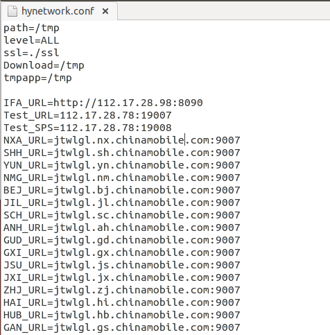
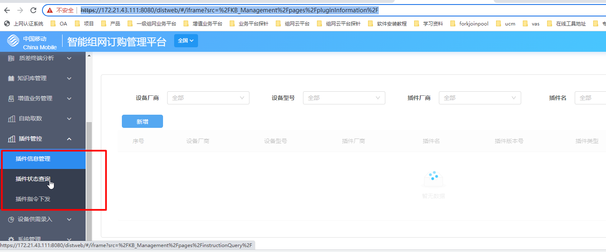
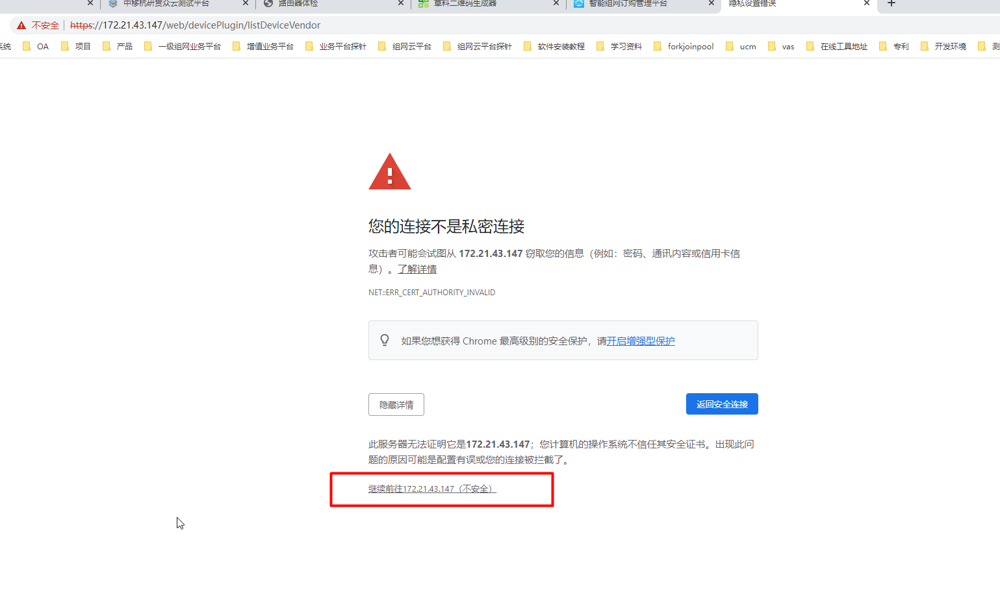
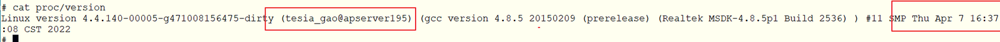
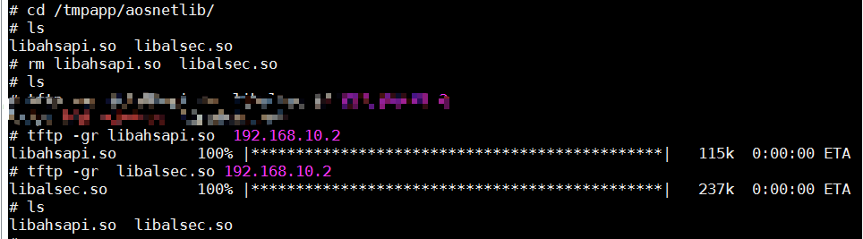
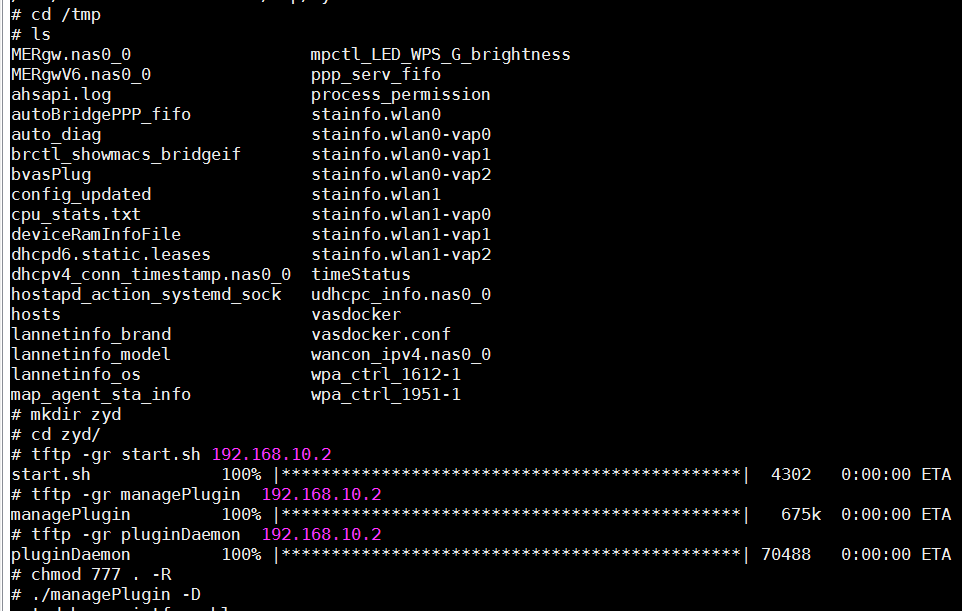
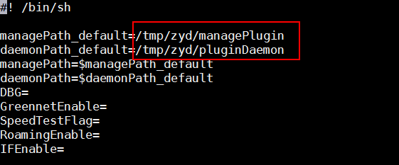
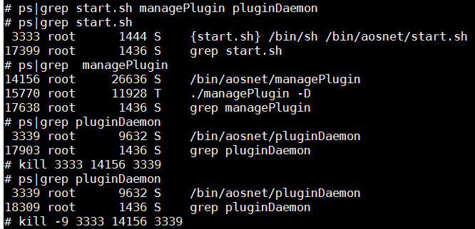
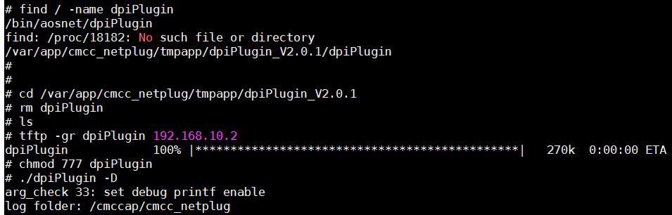
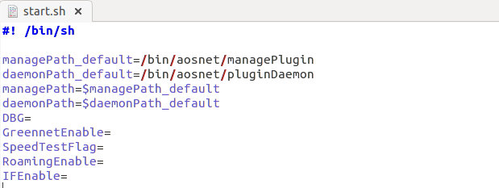

# 启动脚本 start.sh

启动脚本start.h有多个配置命令，可通过"-H\|\--help"来查看。

除启动脚本sart.h外，在调试时、厂商也可手动启动managePlugin或dpiPlugin等业务插件。插件启动时，也可同样设置多个命令。

屏幕打印模式：


```
\"-D \| enable as debug mode(debug_print)\"
```


```
example: ./start.sh -D，./ managePlugin -D， ./dpiPlugin -D
```


静默时间调试模式：

\"-T \| enable as debug test(debug_print, and set quiet_time
%X(unit:s))\"

example: ./start.sh -T 1，./ managePlugin -T 2， ./dpiPlugin -T 3

统一认证无感配网模式（仅managePlugin）：


```
\"-N \| enable: set IOT net with Unified authentication(by GW)\"
```


example: ./start.sh -N 1，./ managePlugin -N

备注：

if5 DM-规范要求在\[0,24h\]区间随机值；

if8-周期上报功能，启动时设置了随机静默值\[0,300\];默认开启、上报周期为30min;

if8-业务监测上报功能，启动时设置了随机静默值\[0,300\]; 默认关闭;

if8-配置指令强校验:reportInterval基数为600s, sampleInterval基数为60s;

(设置setDmDebug(XX)后，静默值改为XX，并去除配置指令强校验)

# 配置文件杭研network.conf-切换生产/测试环境

目录：

```
/etc/hynetwork.conf
```


如需切换测试环境，修改配置文件、新增如下内容：

//coap log等级


```
coap_level=DEBUG
```

//家庭版 if6省码联调环境地址

```
IF6_PRO_MAIN_URL=http://112.17.28.70:8088
```

```
IF6_PRO_VICE_URL=http://112.17.28.70:8088
```

//家庭版 IF5
```
IF5_CGW_URL=http://112.17.28.78:8085
```

//健康平台
```
IF5_HEALTH_URL=http://112.17.28.80:8080
```

//家庭 新IF8
```
IFA_URL=http://112.17.28.98:8090
```

```
Test_URL=112.17.28.78:19007
```


//IF8 生产环境


```
IFA_URL=http://ifa.ihnm.chinamobile.com:9004
```


 

//政企 if5联调环境


```
IF5_CGW_URL=https://112.17.28.70:8005
```


```
IF5_CGW_URL=https://172.21.43.206:8005  (开发环境)
```


```
Test_URL=112.17.28.78:19007
```


```
IFA_URL=http://112.17.28.98:8090
```


 

//安全部-统一认证


```
Test_SAFE_URL=http://112.17.28.106:8080
```


```
Test_URL=112.17.28.78:19007
```


//AOS-NET软件授权测试环境切换


```
LICENSE_URL=http://112.17.28.70:8088
```




# 插件管理平台

测试环境：

<https://172.21.43.147/web/devicePlugin/listDeviceVendor>

账号：Sadmin Apb@@10086

备注：vpn

打开的时候可能浏览器报错，用浏览器打开以下这个地址





JSU_SAFE_URL=https://homeauth.jsshuzijiating.com:9090

# 统一认证功能（江苏定制版）

使用方式：

1.  managePlugin -N

2.  配置文件hynetwokr.conf 新增认证平台地址（网址中间不要有空格）：

形如，省份码_SAFE_URL=XXXXXX

例如，JSU_SAFE_URL=https://homeauth.jsshuzijiating.com:9090

# 8.mqttfx相关环境配置 

if5_IOT测试环境，mqtt.fx工具配置见附件。

mqtt集群信息如下：
用户名：

```
root@10086
```
密码

```
Cmcc@2017
```

地址

```
test.cgw.komect.com 8883
```


```
test.cgw.komect.com:7883
```


![[Pasted image 20230829103327.png]]


# RTL公版（RTL8198方案）

## 开启telnet方式

1、web页面使用超级账号

web登录：

```
CMCCAdmin
```


```
aDm8H%MdA
```


 

2、登录隐藏URL：

```
http://192.168.10.1/bd/vermod.asp
```


打开telnet开关

3、Telnet的用户名密码：

```
CMCCAdmin
```


```
aDm8H%MdA
```


 

串口方式：

用户名密码 

```用户名
useradmin
```


```密码
useradmin
```


或者
admin/system

## 串口固件升级方式

### 使用工具

rtl板卡（12V1A电源适配器）

usb转ttl串口模块+杜邦线

网线

本机PC+软件工具：putty.exe

固件

### 串口升级流程（在uboot下烧录）

1.         串口连接笔记本与rtl板子。

> (1)      使用usb转ttl串口模块+杜邦线将PC与rtl板子连接；

2.         配置tftp下载固件。

> (1)      网线连接本机PC与rtl板卡lan口（除字母"K"之外的3个都是lan），
>
> (2)      把PC有线IP设为192.168.1.66
>
> (3)      打开
> PC机上TFTP软件,文件路径选择img.rar的绝对路径；（PC机作为tftp service）

3.         串口模式下，进入uboot模式。

> (1)      本机电脑开启软件putty.exe，选择serial类型,波特率
> 115200，确定进入命令界面，
>
> (2)      rtl上电开机，待打印Hit any key to stop autoboot:
> 0时，PC键盘按下任意键进入uboot模式

4.         下载固件并烧录；

> (1)      输入命令 run upt，开始下载并烧录
>
> (2)      输入命令 reset //boot下面重启

备注：直接把这个文件放在tftp根目录就好，用run upt它会从192.168.1.66找img.tar文件。

烧固件的时候，不用管模式（是uboot，路由器没起来），要用网线连板子，然后改成固定ip（192.168.1.66）

 

判断升级是否成功：



设备每次重启后进入串口和telnet 后：先通过kill -9  进程号 杀掉

以下设备默认启动4个进程 start.sh ,dpiPlugin,managePlugin,pluginDaemon

4、cd /tmpapp/Release/bin/aosnet 目录，运行  ./start.sh -D &

5、运行后查看dpiPlugin,managePlugin,pluginDaemon 进程是否启动，正常测试

## web页面升级方式

登录隐藏URL：http://192.168.10.1/bd/vermod.asp

升级img.tar

## 恢复固件出厂配置

烧录后进入cmd文件系统，输入如下命令；

flash default cs

flash default hs

如果还是未清除tmpapp下的文件，请使用

rm /cmccap/\* -rf

## ubus重启及dbglevel设置

ahsapd所在目录，/bin

重启ahsapd方式：

killall ahsapd

/bin/ahsapd &

 

apd debug日志等级设置

ubus call ahsapd.dbglevel set \'{\"dbglevel\": 3}\'

## 移植更新AOS版本

1.  lib库下，更新lib库：libahsapi.so，libalsec.so

cd /cmccap/aosnetlib

tftp 对应lib库到该目录

{width="6.299305555555556in"
height="1.7447244094488188in"}

2.  bin目录下，整体更新bin应用：start.sh, managePlugin, pluginDaemon

插件程序/bin/aosnet目录不可写，所以没法直接替换程序。

但可以把插件程序（start.sh, managePlugin,
pluginDaemon）tftp到一个可写路径，比如/tmp下面

{width="6.299305555555556in"
height="4.000909886264217in"}

再改一下start.sh，从/tmp/managePlugin启动插件

{width="5.84375in"
height="2.4270833333333335in"}

kill掉原来所有的进程，然后重新手动拉起各个bin

{width="6.299305555555556in"
height="3.0456102362204724in"}

3.  bin目录下，临时更新bin：dpiPlugin

{width="6.299305555555556in"
height="2.018416447944007in"}

## 测试步骤

1、启动运行start. sh前，先检查 bin执行的路径是否和start.sh里预置路径一致

{width="6.299305555555556in"
height="2.3711439195100614in"}

2、cd /tmpapp/Release/bin/aosnet 目录，运行  ./start.sh -D &

3、运行后查看dpiPlugin,managePlugin,pluginDaemon 进程是否启动，正常测试

ps\|grep dpiPlugin

## RTL公版FAQ

Q:通过ubus接口保存的配置信息在那个目录，怎么删除？

A: 保存在/cmccap/cmcc_netplug目录

可以直接rm -rf /cmccap/\*删除

 

Q: ANDLINK_PLUGIN_CONFIG_FILE 这个宏定义对应的文件是那个？

A: #define ANDLINK_PLUGIN_CONFIG_FILE        
\"/cmccap/cmcc_netplug/plugin.conf\"

插件相关的配置、日志，都会放到这个目录的

 

Q: lib目录是否可修改？

A: 可读写目录cmccap

 

Q: AOS插件的写保存目录

A:  /cmccap/cmcc_netplug目录，文件名 plugin.conf

（mg和dpi的信息写在一起）

 

Q:bin文件的放置目录

A: /var/app/cmcc_netplug/tmpapp/AOS-NET/bin/aosnet/

managePlugin  pluginDaemon  start.sh

/bin/managePlugin

 

Q：修改省份码方式

A: \$ mib set HW_PROVINCE_NAME \"Test\"

\$ mib commit hs //保存配置

# MTK公版（MT7981方案)

## telnet方式

1\. 【串口】

板子上靠近电源测插针，从J500开始依次为：GND TX RX VCC，接入GND TX RX即可

波特率 115200

 

2\. 【ssh 登录】

IP: 192.168.20.1

用户名：root

密码：空

 

3\. 【web 登录】

<http://192.168.20.1/>

用户名：root

密码：空

4.ahsapd 手动拉起方式

直接在shell中运行 ahsapd.sh

# MTK 乙辰 Q30Pro

<https://192.168.10.1/sysmagic=535a5943?get_loginpassword>

## MTK公版FAQ

bin目录

/bin/aosnet

 

第三方目录

/rom/etc/andlink/dpiPlugin_V2.0.1/dpiPlugin

 

写保存目录

/etc/ahsapd/mtk_andlink_store.cfg

# X86版本

# 附录A ubus集成规范命令 

## 上报接口

//事件上报

ubus send controlReport \'{\"respType\":2,\"respCode\":0}\'

## 查询接口

//stainfo

ubus call ahsapd.sta getStaInfo

 //统一web ：获取login密码

ubus call ahsapd.config getItem \'{\"item\":\"logininfo\"}\'

//flash写保存

ubus call ahsapd.config getCfgPath \'{\"fileType\": 1}\'

## 设置接口

//RadioConfig

ubus call ahsapd.wifi setRadioConfig
\'{\"radio\":\"5G\",\"transmitPower\":\"100\",\"channel\":\"157\",\"bandwidth\":2}\'

 

ubus call ahsapd.wifi setRadioConfig \'{\"radio\": \"5G\",
\"transmitPower\":\"100\"}\'

 

ubus call ahsapd.roaming staDisconnect \'{\"macAddress\":
\"42EEA36FC384\", \"dismissTime\":30000}\' //dismissTime单位是毫秒

 

ubus call ahsapd.wifi setWifiParameter \'{\"configurations\":
\[{\"radio\":\"2.4G\",\"index\":2,\"enable\":1,\"ssid\":\"aaaa-2G-vap0\",\"securityMode\":\"None\",\"encrypt\":0,\"pwd\":\"kkkkkkkk\",\"maxAssociateNum\":32,\"ssidAdvertisementEnabled\":1}\]}\'

 

Qos功能

ubus call ahsapd.qos setQosConfig
\'{\"qosEnable\":1,\"qosParameter\":\[{\"qosPriority\":
0,\"dscpEnable\":1,\"dscpPriority\":23,\"vlan8021pEnable\":1,\"vlan8021p\":0,\"sourceMac\":\"002220004444\",\"destinationMac\":\"002220001234\"}\]}\'

 

ubus call ahsapd.qos setQosConfig
\'{\"qosEnable\":1,\"qosParameter\":\[{\"qosPriority\":
7,\"dscpEnable\":1,\"dscpPriority\":1,\"vlan8021pEnable\":1,\"vlan8021p\":1,\"sourceMac\":\"002200001234\"},{\"qosPriority\":6,\"dscpEnable\":0,\"vlan8021pEnable\":1,\"vlan8021p\":0,\"sourceIp\":\"192.168.1.44\",\"sourcePort\":\"5400\",\"destinationIp\":\"192.168.1.22\",\"protocol\":\"TCP,UDP\"},{\"qosPriority\":6,\"dscpEnable\":0,\"sourceIp\":\"2000::db8\",\"destinationIp\":\"2000::db9\",\"protocol\":\"ICMP\"}\]}\'

 

# 附录B 公版固件

## RTL公版固件

<https://yun.139.com/w/#/groupfile/1411ggPez0271762022040709202201h>

## MTK公版固件

<https://yun.139.com/w/#/groupfile/1411ggPez0271762022040709202201h>

# 附录C 修订记录 

表 A-1 修订记录

  ------------ ------------ -------------------------------- --------------
  版本号       更新时间     主要内容或重大修改               编制人

  V1.0         2022.9.23    初稿                             张依东
  ------------ ------------ -------------------------------- --------------
